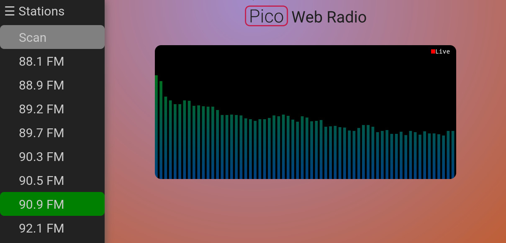

# PicoWebRadio



Simple little web app that uses a Raspberry Pi Pico W to host a website to tune and listen
to AM/FM broadcast radio acquired via an external Si4730 radio receiver module.

## Description

A Raspberry Pi Pico W is used to interface with the Si4730; from scanning and
tuning to stations, acquiring the audio through the Pico's analog-to-digital converter,
to hosting a web page and audio streaming server.\
\
[MicroPython](https://github.com/micropython/micropython) is used on the Pico W side for
the code to interface with the Si4730 and to host the HTML and audio streaming servers.
Audio output from the Si4730 is received via the ADC and DMA on the Pico, which
required the use of native module support in MicroPython.\
\
The web app uses mostly vanilla HTML/CSS/JavaScript and also implements an audio visualizer
via the [Web Audio API](https://developer.mozilla.org/en-US/docs/Web/API/Web_Audio_API).
The web interface is very simple for now, involving a station list as a sidebar with the
ability to scan for and tune to stations, and the audio visualizer as a pause/play canvas.

### Requirements
* A Raspberry Pi Pico W
   * See [Wiring](#Wiring) for the default configuration implemented in the source
   * Technically should be portable to any microcontroller supporting MicroPython
     and consisting of a wireless interface, but the ADC-DMA acquisition needs to
     be re-done for the target platform (e.g. ESP32, though ADC may not be fast enough)
* Si4730 AM/FM receiver module
   * Any Si473x will probably do, but this implementation doesn't account for extra
     features of higher end models
* (Optional) Resistors, capacitors, antennas and the like, depending on if you
  get the radio receiver as a bare IC or in a module with pull-up resistors
  installed, etc.

### Wiring

The control interface from the Pico to the Si4730 uses I²C.

* Default configuration is:
   * Vcc on 3V3_OUT of the Pico W (capable of supplying the necessary current)
   * For I²C, SCL and SDA on Pin(9) and Pin(8) of the Pico W, respectively
   * Audio input is Pin(28) (ADC2) on the Pico W (AC couple the audio output of
     the Si4730 via 220nF, and bias via a resistive divider with 2 100KOhm resistors)

### Configuration

In [NetworkUtil.py](src/mpy/NetworkUtil.py), change *ssid* and *password* to match your AP.

Optionally, if you'd like to modify the default wiring configuration, edit
[PicoWebRadio.py](src/mpy/PicoWebRadio.py); in particular, ADC_CHAN, SI4730_I2C_DEV and
SI4730_RESET_PIN.

### Building

Make sure you pull in the required submodules (MicroPython and Pico-SDK):
```
git submodule update --init
```

The ARM EABI GCC compiler is used to compile the MicroPython native module. For example,
this package can be acquired in Arch Linux via:
```
pacman -Syu arm-none-eabi-gcc
```

Then run [configure](configure) to generate the required headers for the native module:
```
./configure
```

Finally run make:
```
make
```

Running this on the Pico W requires MicroPython firmware to be installed; see
[Raspberry Pi Documentation - MicroPython](https://www.raspberrypi.com/documentation/microcontrollers/micropython.html)
for details. Once MicroPython is running, you can use something like
[rshell](https://github.com/dhylands/rshell) to flash the app (e.g. transfer the build to the Pico W):
```
make flash
```

To then run the app on the Pico W, open a terminal session to MicroPython, e.g. on Linux:
```
screen /dev/ttyACM0
```

then in the REPL run:
```
>>> import PicoWebRadio
>>> PicoWebRadio.run()
```

This should connect to your network provided you entered the credentials above in
[Configuration](#Configuration). The Pico W's IP address should be printed in the REPL,
at which point you can browse to that address on port 80 to use the app.\
\
You can also test the web app without any additional hardware. First run:
```
make test
cd test
./run_test.sh
```

and then go to http://localhost:8080 in a browser to view the web app. Note
that this test requires an audio test file named *test.wav* placed in the
[test](test) directory. Any WAV file should do, though it should be easy
to modify the test to use and audio file (see [audio_srv.py](test/audio_srv.py)).

## TODO

* Improve website functionality
   * Add a section for favourite stations
   * Add option to change the audio visualizer to a scope view or disable altogether
   * Create view to see radio signal quality metrics
   * Organize station list sidebar into radio band dropdowns (e.g. AM>, FM>)
* Generate a format of audio on the Pico W that is universally supported; iOS/Safari doesn't support WAV files
   * MP3 would allow longer buffer potentially, but encoding on Pico W may require too much memory
   * Maybe FLAC with Ogg container (but this too seems unsupported by Apple)
* In the meantime audio could be compressed in memory via ADPCM to hold a longer buffer
* Look into WebSockets and/or WebRTC to see if streaming conditions could improve
* Make [the Si4730 implementation](src/mpy/Si4730.py) asynchronous so that scanning/tuning doesn't
  hang the audio and HTML servers
* Work on allowing more than one connection to the audio streaming server (currently has performance
  issues)
* Re-implement the MicroPython native module using the Pico-SDK standard library instead of register
  macros and structs
   * Requires looking into CMake configuration to not build and depend on e.g. system init. modules in the SDK

## License

This project is licensed under The MIT License (MIT) - see the [LICENSE](LICENSE) file for details.
